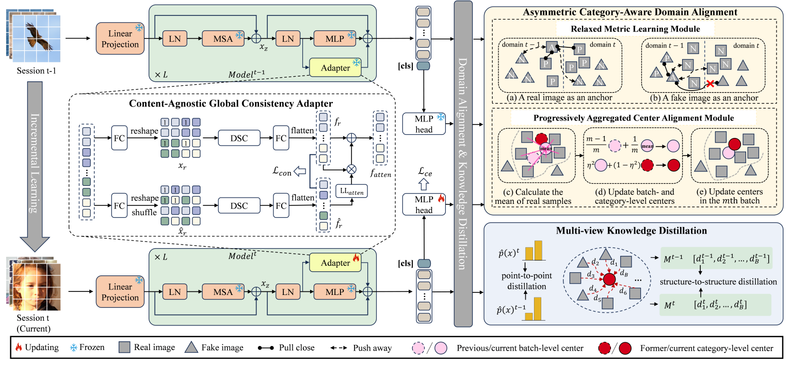

##  Towards Extensible Detection of AI-Generated Images via Content-Agnostic Adapter-Based Category-Aware Incremental Learning
This is the official code for this article.
[Paper](https://ieeexplore.ieee.org/stamp/stamp.jsp?tp=&arnumber=10908386)

## Overview


## Python version
pytorch 2.1.1

python 3.11.5

cuda 12.5

others in requirements.txt

## Training

Due to the large size of the original dataset, only the data used in the protocol2 is provided here.
data and the split of protocol2 [data](https://pan.baidu.com/s/17lqalzMdp-mYdiy6cdYG4Q?pwd=ff48)

The checkpoint of ViT [checkpoint](https://pan.baidu.com/s/1qwMcaC5gt4Bvk1VzrDJoOw?pwd=mfkh)

# Training Script
```
python main.py -model vit_xception_center --run_type train --split split2 -ms 100 -init 2 -incre 1 -d 0

-model: Specify the model to be selected in utils.factory
--run_type: train/test
--split: protocol in article
--ms: the size of the replay set. 100 in the paper. 0 denotes no replay set
--init: Specify the number of models in the first session. In protocol2 (split2), it should be set to 2
--incre: Specify the number of new models in the incremental session. In this article, it should be set to 1
-d: gpu
```

## Testing

The checkpoint of protocol2 [checkpoint](https://pan.baidu.com/s/1shnaQxigNTExQ4wpYiwKAw?pwd=wq33)

```
python main.py -model vit_xception_center --run_type test --split split2 -ms 100 -init 2 -incre 1 -d 0 --skip

when loading checkpoints for testing, modify the trained_path in configs/vit_xception_center.json
```

## Citation
```
@article{tang2025towards,
  title={Towards Extensible Detection of AI-Generated Images via Content-Agnostic Adapter-Based Category-Aware Incremental Learning},
  author={Tang, Shuai and He, Peisong and Li, Haoliang and Wang, Wei and Jiang, Xinghao and Zhao, Yao},
  journal=IEEE_J_IFS,
  volume = {20},
  pages = {2883-2898},
  year={Feb. 2025},
  publisher={IEEE}
}
```